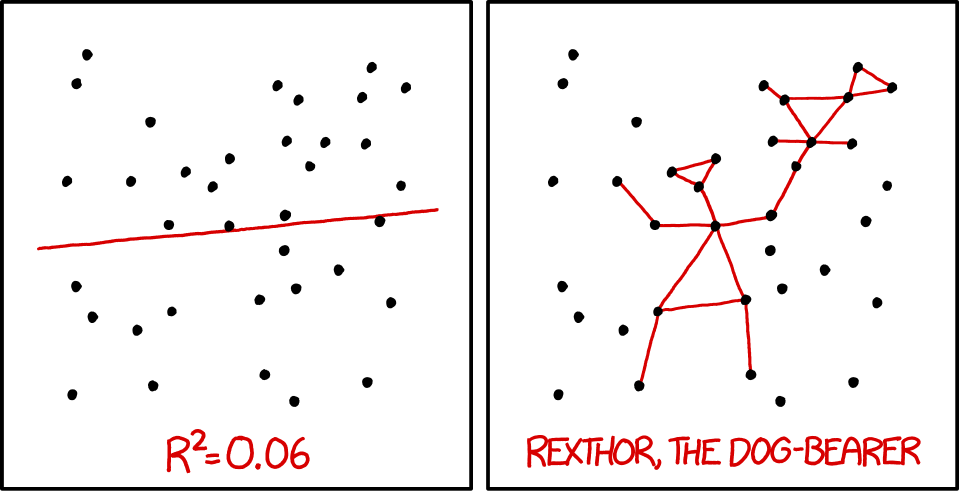

\newcommand{\nate}[1]{{\color{olive}{#1}}}
\newcommand{\kiegan}[1]{{\color{teal}{#1}}}
\newcommand{\dbtilde}[1]{\accentset{\approx}{#1}}

```{r setup, include=FALSE}
knitr::opts_chunk$set(echo = FALSE)
```

```{r packages, echo = F, warning = F, message = F}
library(tidyverse)
library(gridExtra)
library(knitr)
library(cvTools)
library(class)
library(caret)
library(elasticnet)
library(earth)
library(pls)
library(reshape2)
library(kernlab)
library(randomForest)
library(ranger)
library(nnet)
library(rpart)
library(C50)
library(glmnet)
library(klaR)
library(Cubist)
library(xgboost)
library(caretEnsemble)
library(MLmetrics)
```

## Stat 602 Final Project: </br> Don't Overfit! II  


<p class = "black">
Nate Garton and Kiegan Rice
</p>

  


## Background
- Kaggle's "Don't Overfit! II" competition
- 250 cases in training / 19,750 in testing  
    - 1,975 (10%) testing cases used for public leaderboard
- AUROC used for scoring  
- 300 feature columns
    - no column names  
- Response: 0-1 Classification  


## EDA
```{r, eval = TRUE, echo = FALSE}
train <- read.csv(file = "kaggle/data/train.csv", check.names = FALSE, strip.white = TRUE)
train_c0 <- train[train$target == 0,]
train_c1 <- train[train$target == 1,]
## class 0
mins_c0 <- (apply(X = as.matrix(train_c0[,-c(1:2)]), MARGIN = 2, FUN = min))
maxs_c0 <- (apply(X = as.matrix(train_c0[,-c(1,2)]), MARGIN = 2, FUN = max))
means_c0 <- (apply(X = as.matrix(train_c0[,-c(1,2)]), MARGIN = 2, FUN = mean)) ## looks suspiciously like iid normal
sds_c0 <- (apply(X = as.matrix(train_c0[,-c(1,2)]), MARGIN = 2, FUN = sd)) ## most columns have sd = 1


## class 1
mins_c1 <- (apply(X = as.matrix(train_c1[,-c(1:2)]), MARGIN = 2, FUN = min))
maxs_c1 <- (apply(X = as.matrix(train_c1[,-c(1,2)]), MARGIN = 2, FUN = max))
means_c1 <- (apply(X = as.matrix(train_c1[,-c(1,2)]), MARGIN = 2, FUN = mean)) ## looks suspiciously like iid normal
sds_c1 <- (apply(X = as.matrix(train_c1[,-c(1,2)]), MARGIN = 2, FUN = sd)) ## most columns have sd = 1

## create data frame with the above info
mins <- c(mins_c0, mins_c1)
maxs <- c(maxs_c0, maxs_c1)
means <- c(means_c0, means_c1)
sds <- c(sds_c0, sds_c1)

summary_df_wide <- data.frame("predictor" = rep(1:300, times = 2), "cls" = factor(rep(c(0,1), each = 300)), 
                              "mins" = mins, "maxs" = maxs, "means" = means, "sds" = sds)

summary_df_long <- reshape(data = summary_df_wide, varying = c("mins","maxs","means","sds"),v.names = "value", direction = "long", timevar = "stat", times = c("mins","maxs","means","sds"))

summary_hist <- ggplot(data = summary_df_long) +
  geom_histogram(mapping = aes(x = value), bins = 20) +
  facet_grid(rows = vars(cls), cols = vars(stat), scales = "free_x") +
  theme_bw()

summary_hist
```

## EDA: Class Conditional Densities  

```{r, echo = F, warning = F, message = F, fig.height = 5, fig.width =9}

plot_cols <- c(15, 84, 128, 260, 33, 65, 117, 217)
# no sep: 260, 128, 15, 84
# sep: 33, 65, 91, 117, 217
train %>% 
  gather(plot_cols+3, key = "col_num", value = "value") %>%
  mutate(col_num = factor(col_num, levels = c("15", "84", "128", "260", "33", "65", "117", "217"))) %>%
  ggplot() + geom_density(aes(x = value, fill = factor(target)), alpha = 0.6) + 
  facet_wrap(~col_num, nrow = 2) + 
  theme_bw() + 
  scale_fill_discrete(name = "Response Class") + 
  labs(x = "Value", y = "Density")
  
```


## EDA: Class Conditional Densities
- Shapiro-Wilk tests for normality for each column conditional on class
- KS tests that p-values from SW test are $U(0,1)$
    - p-value for class 0: $0.904$ 
    - p-value for class 1: $0.997$
- Fisher transformation on class conditional column correlations
- KS tests that p-values from Z-tests are $U(0,1)$
    - p-value for class 0: $0.113$
    - p-value for class 1: $0.905$
- t-tests of differences in column means between classes
    - columns 33 and 65 have p-values that survive Bonferroni correction  

    
## Feature Engineering
- Only consider functions of variables retained by a LASSO on raw data  
- univariate Gaussian log-LRs  
- univariate kernel density log-LRs  

## Model Fitting  
- Random forest with all raw features + Gaussian log-LRs 
    - using OOB error for training
    - Final AUROC: 0.773 ($\downarrow$ 0.007)
- LASSO with all raw features + Gaussian log-LRs ($\lambda_{1se}$)
    - keeps only the raw column 33 and 65
    - Final AUROC: 0.833 ($\downarrow$ 0.015)  
- Combined predictions for a few models 
    - Averaged testing set predictions on two LASSO models and a random forest  
    - (Barely) better public AUROC initially
    - Final AUROC: 0.833 ($\downarrow$ 0.016)  
    
## Failed Ideas
- Fitting flexible predictors on all raw data (or raw data + engineered features)
    - Fitting flexible predictors on small sets of engineered features worked better, but not competitive  
- Unsupervised clustering to hunt for signal, relationships between variables  
    - Model-based clustering using `Mclust` package  
    - Resulting clusters essentially random sample of response classes  

## Takeaways  
- Feature engineering is difficult when there is: 
    - small sample size
    - no context for features or response  
- Assumptions are important, but CV is king  
- Food for thought: 
    - With LASSO, performance doesn't seem to suffer when adding more predictors. With more "flexible" predictors,  this is not the case even though we still use CV to choose penalty parameters. Why?  
- We did not win 
    
## If we had more time...
- Test several hypothetical generative data models for compatibility with training data  
- Bayes  
- Testing additional classification methods  
- True "ensembling" with one feature matrix and multiple prediction methods  
